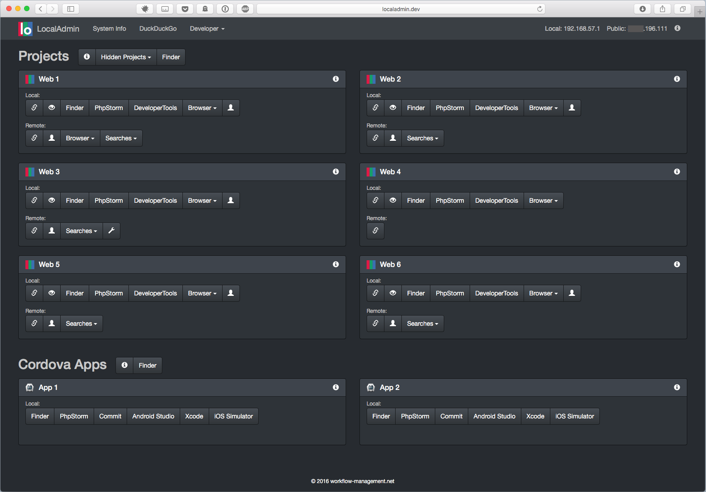

#LocalAdmin - Having Things in one Place

Weeks ago I deleted Apples Server.app (I had to much trouble to set up vhosts.). I did my own server and was looking for a project administration tool.

I found [Localhomepage](http://cmall.github.io/LocalHomePage/), a great idea and nice tool from [Chris Mallinson](https://mallinson.ca). I decided to pick up the idea and bring some automation and developer things into it.

Wouldn't it be nice to have one place, where you have all your project links, starting your IDE/SDK, jump to the project directory, open the project in different browsers, open files, open developer tools, iOS Simulator, …?

I did some development and the result is LocalAdmin - get in touch with it:

 

---
##Table of Contents

[1. Screenshots](#1-screenshots)   
[2. Who should use LocalAdmin?](#2-who-should-use-localadmin)   
[3. Requirements](#3-requirements)   
[4. Get started](#4-get-started)   
[5. How it works](#5-how-it-works)   
&nbsp;&nbsp;&nbsp;&nbsp;&nbsp;[5.1 Practical Example](#51-practical-example)   
&nbsp;&nbsp;&nbsp;&nbsp;&nbsp;[5.2 Advanced Example](#52-advanced-example)   
[6. Settings](#6-settings)   
&nbsp;&nbsp;&nbsp;&nbsp;&nbsp;[6.1 General Behavior of LocalAdmin](#61-general-behavior-of-localadmin)  
&nbsp;&nbsp;&nbsp;&nbsp;&nbsp;[6.2 Splashscreen](#62-splashscreen)  
&nbsp;&nbsp;&nbsp;&nbsp;&nbsp;[6.3 Top Navigation](#63-top-navigation)  
&nbsp;&nbsp;&nbsp;&nbsp;&nbsp;&nbsp;&nbsp;&nbsp;&nbsp;&nbsp;[6.3.1 Top Navbar General Settings](#631-top-navbar-general-settings)  
&nbsp;&nbsp;&nbsp;&nbsp;&nbsp;&nbsp;&nbsp;&nbsp;&nbsp;&nbsp;[6.3.2 Top Navbar Links](#632-top-navbar-links)  
&nbsp;&nbsp;&nbsp;&nbsp;&nbsp;[6.4 All Projects](#64-all-projects)  
&nbsp;&nbsp;&nbsp;&nbsp;&nbsp;[6.5 Project Groups](#65-project-groups)   
&nbsp;&nbsp;&nbsp;&nbsp;&nbsp;[6.6 Settings for each Project](#66-settings-for-each-project)   
&nbsp;&nbsp;&nbsp;&nbsp;&nbsp;[6.7 Buttons](#67-buttons)
[7. URL Launcher](#7-url-launcher)   
[8. Shell Scripts](#8-shell-scripts)   
[9. Security](#9-security)   
[10. Advanced Use Cases](#10-advanced-use-cases)   
[11. Extending LocalAdmin](#11-extending-localadmin)   
[12. History](#12-history)   
[13. Credits](#13-credits)   
[14. Links](#14-links)   
[15. License](#15-license)   


##1. Screenshots
 

##2. Who should use LocalAdmin?
Webdevelopers, Back- and Frontend-People, Cordova- and Phonegap Developers, Automation Developers and every one who wants to use a local webdriven folder and document tool.

##3. Requirements

– local web server

– local wildcard domain (tld)

– PHP >= 5.6, works great with PHP 7

– For best experience: [LocalAdmin-URL-Scheme-Launcher](https://github.com/JoergHolz/LocalAdmin-URL-Scheme-Launcher) (OS X only)


##4. Get started

1. If you have not setup a local webserver, PHP and a local wildcard domain, then do so. Here are some links:

     Mac OS X: [The Perfect Web Development Environment for Your New Mac](https://mallinson.ca/osx-web-development/)
   
     Windows: [Apache 2.x on Microsoft Windows](http://php.net/manual/en/install.windows.apache2.php)  
     Windows Wildcard Domain: [Wildcard Subdomains in Apache](http://blog.calcatraz.com/wildcard-subdomains-in-apache-1422)
   
     Linux: [Apache 2.x on Unix systems](http://php.net/manual/en/install.windows.apache2.php)  
     Linux Wildcard Domain: [Dnsmasq](http://www.thekelleys.org.uk/dnsmasq/doc.html)

2. Download and unzip localadmin

3. Move it to the root of your webserver where all your other project are

4. Depending on your vhost settings, there may be a need of some changes. The document root of LocalAdmin is /htdocs. If you want to move the folder htdocs somewhere else, read below [Extending LocalAdmin](#11-extending-localadmin) 

5. Open settings.php in localadmin/application/config and find the following configurations:

    Set your local wildcard domain in "tld":

        $config["general"] = [
               "tld" => "dev",
               ...

    Set the absolute path to your web root in "directory":

   
        $config["project_group"][0] = [
                "name" => "My Projects",
                "directory" => "/absolute/path/to/webroot/",
                ...

           
    
    Example: "/Users/your_username/Sites/" **(Don't forget the slashes!)**
  
6. Install [LocalAdmin-URL-Scheme-Launcher](https://github.com/JoergHolz/LocalAdmin-URL-Scheme-Launcher) (OS X only)

7. Open LocalAdmin in your browser, e. g.: http://localadmin.dev

8. You are done!

##5. How it works

LocalAdmin lists all folders (No files!), which are in a given directory **AND** the content of these folders matches your "matching_path". Some examples:

Lists everything in your webroot. This is the default.

```
$config["project_group"][0] = [
        "directory" => "/absolute/path/to/webroot/",
        "matching_path" => "/",
        ...
```
 Lists only folders, which have inside a www folder:
 
```     
$config["project_group"][0] = [
        "directory" => "/absolute/path/to/webroot/",
        "matching_path" => "/www/",
        ...
```
 
Lists only folders, which have inside a www/htdocs folder (This is the standard structure I use in my webprojects):

```
$config["project_group"][0] = [
       "directory" => "/absolute/path/to/webroot/",
        "matching_path" => "/www/htdocs/",
        ...
```

###5.1 Practical Example

Let's say you have the following folder structure in your webserver root:

```
mobile-apps
    app1
        platforms
    app2
        platforms
    app3
        platforms
       
miller-company
    backend
        htdocs
    frontend
        htdocs
    shop
        htdocs
    documents
        logos
         
my_web1
    htdocs
my_web2
    htdocs
my_web3
    htdocs
    documents
        redame.txt
my_web4
    htdocs
```

Your settings could look like:

```
$config["project_group"][0] = [
        "directory" => "/absolute/path/to/webroot/mobile-apps/",
        "matching_path" => "/",
        ...

$config["project_group"][1] = [
        "directory" => "/absolute/path/to/webroot/miller-company/",
        "matching_path" => "/htdocs/",
        ...
        
$config["project_group"][2] = [
        "directory" => "/absolute/path/to/webroot/",
        "matching_path" => "/htdocs/",
        ...
```

The first setting lists every folder in mobile-apps because of the simple slash.

The second setting lists the folders backend, frontend and shop **but not** the documents folder, because it has no htdocs inside.

The third setting lists my_web1 … my_web4 **but not** the folders mobile-apps and miller-company, because … right, they don't have a htdocs in the first level.


####5.2 Advanced Example
Lets take the above example an say we want to have an extra group listed in LocalAdmin which contains all projects having a document folder inside:
 
```
$config["project_group"][0] = [
        "directory" => "/absolute/path/to/webroot/",
        "matching_path" => "/documents/",
        ...
``` 

This would list: miller-company and my_web3

##6 Settings

You find all settings in the file application/config/settings.php. All settings are stored in an array called $config and grouped into:

###6.1 General Behavior of LocalAdmin

Saved in:

```
$config["general"]
```

Default settings:

```
$config["general"] = [
    "tld" => "dev",
    "show_tooltips" => TRUE,
    "allow_shell_scripts" => FALSE,
    "button_groups_in_two_rows" => FALSE,
    "button_groups_in_two_rows_at" => 600
];
```

Description:

| Key        | Type          | Description  |
| ------------- |-------------| -----|
| "tld"      | String | name of your local wildcard TLD, default "dev". **If you don't use a wildcard TLD, LocalAdmin will not work properly out of the box.**
| "show_tooltips"      | Boolean      | set to TRUE to show tooltips |
| "allow_shell_scripts" | Boolean      | enables support for shell scripts, default FALSE. **Before enabling, read the sections [Shell Scripts](#shell-scripts) and [Security](#security).** |
| "button_groups_in_two_rows"|Boolean|how the button groups will be shown: FALSE (Default) in one row, TRUE in two rows. This setting overrides the same called settings in project groups and settings for each project.
|"button_groups_in_two_rows_at"|Integer|the window width in pixel, when the button groups will shown in two rows. Good for small browser windows.


###6.2 Splashscreen
The splashscreen is the start screen of LocalAdmin. It prevents you to use LocalAdmin until it is fully loaded.

Saved in:

```
$config["splashscreen"]
```

Default settings:

```
$config["splashscreen"] = [
    "show_splashscreen" => TRUE,
    "logo_path" => "images/default/splashscreen_logo.png",
    "text" => "Loading"
];
```

Description:

| Key        | Type          | Description  |
|-------------|-------------|-----|
|"show_splashscreen"|Boolean|enables/disables the splashscreen|
|"logo_path"|String|relative path to splashscreen logo, leave blank to hide, default size: 128px x 128px |
|"text"|String|text or html to be displayed, default "Loading"|

###6.3 Top Navigation

Saved in:

```
$config["navbar"]
```

####6.3.1 Top Navbar General Settings

Saved in:

```
$config["navbar"]["general"]
```

Default settings:

```
$config["navbar"]["general"] = [
    "title" => "LocalAdmin",
    "logo_path" => "images/default/navbar_logo.png",
    "show_local_ip" => TRUE,
    "show_public_ip" => TRUE
];
```

Description:

| Key        | Type          | Description  |
|-------------|-------------|-----|
|  "title"|String|title of this backend, leave blank to hide|
|  "logo_path"|String|relative path to navbar logo, leave blank to hide, size: 32px x 32px|
|  "show_local_ip"|Boolean|set to TRUE to show local IP
|  "show_public_ip"|Boolean|set to TRUE to show public IP of your network, makes request to: https://api.ipify.org


####6.3.2 Top Navbar Links

Navigation links can be simple links or dropdowns.

Saved in:

```
$config["navbar"]["links"]
```

Default settings:

```
$config["navbar"]["links"] = [
    0 => [
        "name" => "System Info",
        "url" => "?c=localadmin&m=systeminfo",
        "target" => "_self",
    ],
    1 => [
        "name" => "DuckDuckGo",
        "url" => "https://duckduckgo.com"
    ],
    2 => [
        "name" => "Developer",
        "dropdown" => [
            0 => [
                "name" => "LocalAdmin on Github",
                "url" => "https://github.com/JoergHolz/LocalAdmin"
            ],
            1 => [
                "name" => "LocalAdmin URL-Scheme-Launcher on Github",
                "url" => "https://github.com/JoergHolz/LocalAdmin-URL-Scheme-Launcher",
                "divider" => TRUE
            ],
            2 => [
                "name" => "Stackoverflow",
                "url" => "https://stackoverflow.com"
            ]
        ]
    ]
];
```


Description:

| Key        | Type          | Description  |
|-------------|-------------|-----|
|"name"|String|link name|
|"url"|String|where to jump|
|"target"|String|where to show, if empty "_blank" is used|
|"dropdown"|Array|indicates a dropdown|
|"divider"|Boolean|set to TRUE to show a divider (separator line) below a link in dropdown


###6.4 All Projects
Saved in:

```
$config["all_projects"]
```

Default settings:

```
$config["all_projects"] = [
    "hide_if_contains" => ""
];
```


Description:

| Name        | Type          | Description  |
|-------------|-------------|-----|
|"hide_if_contains"|String| If you want to hide projects (directories) which name contains a word or phrase, this is the right place to do it.  

###6.5 Project Groups

A project group is a collection of directories in a specific path (setting: "directory") and a matching structure (setting: "matching_path").

Before you start to make your settings, you should read [How it works](#5-how-it-works).

Saved in:

```
$config["project_group"]
```

Basic setup, which lists all directories. Use this one as a template and extend it to your needs:

```
$config["project_group"][0] = [
    "name" => "",
    "directory" => "/absolute/path/to/webroot/",
    "matching_path" => "/",
    "has_subdomains" => FALSE,
    "columns" => 2,
    "button_groups_in_two_rows" => FALSE,
    "hidden_sites" => [],
    "title_buttons" => [],
    "local_button_group" => [],
    "remote_button_group" => []
];
```

Showing two project groups:

```
$config["project_group"][0] = [
    "directory" => "/absolute/path/to/webroot/",
    "matching_path" => "/", 
    ...
];

$config["project_group"][1] = [
    "directory" => "/absolute/path/to/webroot/another_path/",
    "matching_path" => "/", 
    ...
];
```

Description:

| Name        | Type          | Description  |
|-------------|-------------|-----|
| "name" | String | display name of project group, if empty directory name will used  |
| "directory" | String | absolute path to your webroot/projectfolder, read [How it works](#5-how-it-works)   |
| "matching_path" | String | the path matching condition for showing folders/projects, read [How it works](#5-how-it-works)  |
| "has_subdomains| Boolean | set to true, if you have setup your vhost to use subdomains in the path of your project group  |
| "columns" | Integer | number of projects to be shown in one row, can be 1, 2, 3 or 4  |
| "button_groups_in_two_rows" | Boolean | set to true, if you want to show the local-/remote-button-group in two rows.  |
| "hidden_sites" | Array | list here all sites by their directory names, which you don't want to see in your project group  |
| "title_buttons" | Array | setup for buttons, shown right of the project group name, see [6.7 Buttons](#67-buttons)  |
| "local_button_group" | Array | see [6.7 Buttons](#67-buttons)   |
| "remote_button_group" | Array | see [6.7 Buttons](#67-buttons)  |


Default project group setup in settings.php, read [4. Get started](#4-get-started):


###6.6 Settings for each Project

```
$config["site_options"]
```

###6.7 Buttons
Button are grouped in button groups and you can define them at these places:


##7. URL Launcher

##8. Shell Scripts

##9. Security
You can do some powerful task with LocalAdmin - therefor harden your enviroment. On default Localadmin has a .htaccess in htdocs, which limits the permission only to the local machine.

If you don't use local domains
https://perishablepress.com/htaccess-password-protection-tricks/
##10. Advanced Use Cases

##11. Extending LocalAdmin

LocalAdmin is based on [Codeigniter](https://www.codeigniter.com).
###11.1 Moving htdocs
If you need or want to change the location of htdocs, then you have to change these two setting in index.php:

```
$system_path = '../system';
```

```
$application_folder = '../application';
```

###11.2 Creating your own Buttons
Every button type has a corresponding private function, which is located in application/controllers/LocalAdmin.php.

If you define a new type «my_button»:
 
```
 "local_button_group" => [
         "title" => "Local:",
         "buttons" => [
             0 => [
                 "type" => "my_button",
                 "key1" => "value1",
                 "key2" => "value2"
             ]
         ]
     ]
```

You need the private function «_my_button» in application/controllers/LocalAdmin.php

```
  function _my_button($button){
        // create your button as <a href='…>label</a> and return it
    }
```
The function has to return HTML, see the other button functions in application/controllers/LocalAdmin.php.

$button contains:
```
[type] => my_button
[key1] => value1
[key2] => value2
[file] => /path/to…/example
[domain] => example
[siteroot] => http://example.dev
[project] => example
[target] => _blank
[tooltip] => 
```

How to create Bootstrap Buttons: [Buttons](http://getbootstrap.com/css/#buttons). Remember to return \<a> buttons otherwise you have to write same CSS and urlencode your links.

##12. History

Version: 1.0

##13. Credits

Christa  
[Chris Mallinson](https://mallinson.ca)


##14. Links

[Codeigniter](http://www.codeigniter.com)  
[Bootstrap](http://getbootstrap.com)  
[Localhomepage](http://cmall.github.io/LocalHomePage/)  
[ipify](https://www.ipify.org)  

##15. License

MIT License (MIT)

Copyright (c) 2016 Jörg Holz | [https://www.workflow-management.net](https://www.workflow-management.net)

Permission is hereby granted, free of charge, to any person obtaining a copy
of this software and associated documentation files (the "Software"), to deal
in the Software without restriction, including without limitation the rights
to use, copy, modify, merge, publish, distribute, sublicense, and/or sell
copies of the Software, and to permit persons to whom the Software is
furnished to do so, subject to the following conditions:

The above copyright notice and this permission notice shall be included in all
copies or substantial portions of the Software.

THE SOFTWARE IS PROVIDED "AS IS", WITHOUT WARRANTY OF ANY KIND, EXPRESS OR
IMPLIED, INCLUDING BUT NOT LIMITED TO THE WARRANTIES OF MERCHANTABILITY,
FITNESS FOR A PARTICULAR PURPOSE AND NONINFRINGEMENT. IN NO EVENT SHALL THE
AUTHORS OR COPYRIGHT HOLDERS BE LIABLE FOR ANY CLAIM, DAMAGES OR OTHER
LIABILITY, WHETHER IN AN ACTION OF CONTRACT, TORT OR OTHERWISE, ARISING FROM,
OUT OF OR IN CONNECTION WITH THE SOFTWARE OR THE USE OR OTHER DEALINGS IN THE
SOFTWARE.